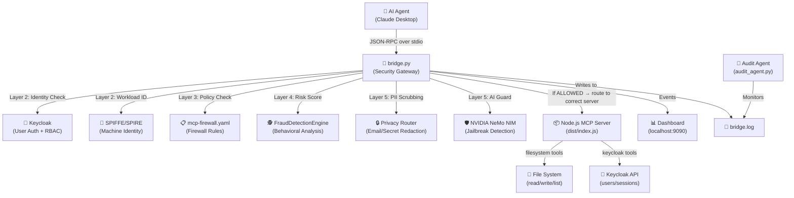
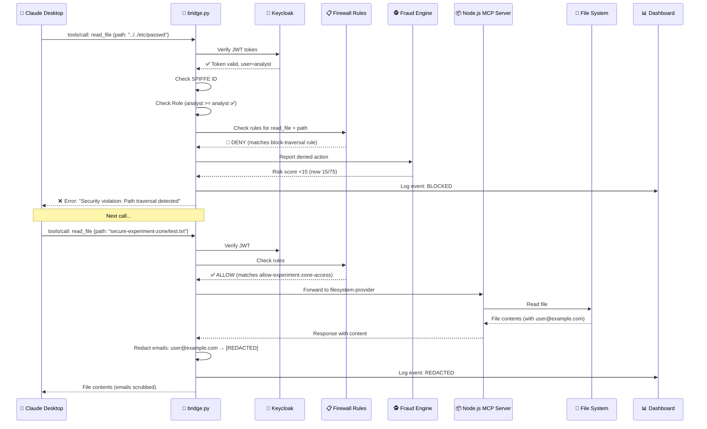

# 🛡️ Runtime Shield for Agentic Systems — Complete Project Walkthrough

> [!NOTE]
> This document explains **every single file**, how they connect, and how the entire system works — written for someone who is brand new to the project.

---

## 1. What is This Project? (The Big Picture)

Imagine you have an **AI assistant** (like Claude Desktop) that can use "tools" — it can read files, list users, write files, etc. But what if the AI gets **tricked by a malicious prompt** into reading your passwords, or accessing admin-only data?

**This project is a Security Shield** that sits **between** the AI agent and the tools it uses. It inspects every single tool call the AI makes and decides:
- ✅ **Allow** — safe, go ahead
- 🚫 **Block** — nope, that's dangerous
- ✂️ **Redact** — allow it but scrub out sensitive info (like emails) from the response

### Real-World Analogy
Think of it like an **airport security checkpoint**:
- The AI agent is a passenger trying to board a plane (use a tool)
- The Shield checks their ID (identity verification)
- Checks if they're on the no-fly list (firewall rules)
- Scans their luggage for weapons (fraud detection)
- Removes any prohibited items (PII redaction)

---

## 2. Architecture Overview



---

## 3. The 5-Layer Defense Framework

Every tool call goes through **5 security layers** before it reaches the actual tool:

| Layer | Name | What It Does | Where in Code |
|-------|------|-------------|---------------|
| **Layer 1** | Infrastructure Isolation | Runs tools in sandboxed/jailed processes | `JailFactory` class in `bridge.py` |
| **Layer 2** | Identity & Auth | Verifies WHO is making the call (Keycloak JWT + SPIFFE workload ID) | `JWTVerifier`, `spiffe_allowed()` in `bridge.py` |
| **Layer 3** | Policy Firewall | Checks the tool call against rules in `mcp-firewall.yaml` | `Gateway.check()` in `bridge.py` |
| **Layer 4** | Fraud Engine | Tracks risk scores per agent — quarantines if suspicious patterns detected | `FraudDetectionEngine` class in `bridge.py` |
| **Layer 5** | Privacy Router | Strips emails, PII, secrets from tool responses before AI sees them | `gw.scan_response()` + regex in `bridge.py` |

---

## 4. File-by-File Breakdown

### 📁 Project Structure

```
Runtime-shield-for-agentic-systems/
├── bridge.py                 ← 🧠 THE BRAIN — main security gateway (Python)
├── mcp-firewall.yaml         ← 📋 Firewall rules configuration
├── .env / .env.example       ← 🔐 Environment variables (secrets, URLs)
├── docker-compose.yml        ← 🐳 Starts Keycloak + SPIRE containers
├── package.json              ← 📦 Node.js dependencies
├── tsconfig.json             ← ⚙️ TypeScript compiler config
│
├── src/                      ← 📂 TypeScript source (MCP Server)
│   ├── index.ts              ←    Entry point — creates MCP server
│   ├── tools/
│   │   ├── tools.ts          ←    All tool implementations (read_file, keycloak_*, etc.)
│   │   ├── rbac.ts           ←    Role-Based Access Control helpers
│   │   └── spiffeAuth.ts     ←    SPIFFE identity verification
│   └── utils/
│       └── keycloak.ts       ←    Keycloak admin client connection
│
├── dist/                     ← 📂 Compiled JavaScript (from `npm run build`)
│   └── index.js              ←    Compiled entry point (runs in Node.js)
│
├── audit_agent.py            ← 🕵️ Background AI auditor (uses NVIDIA NIM)
├── shield_sdk.py             ← 🔌 Client SDK for customers to integrate
├── dashboard_client.py       ← 📊 Multi-tenant dashboard config negotiation
├── claude_config.txt         ← 📝 Sample Claude Desktop config
├── demo/                     ← 📂 Test scripts, demos, and legacy files
│   ├── demo_chatbot_integration.py
│   ├── demo_prompts_cheatsheet.md
│   ├── test_stub_execution.py
│   ├── vulnerable_mcp_actions.py
│   ├── check_keycloak.py
│   ├── fix_keycloak_roles.py
│   ├── patch_keycloak.py
│   ├── nsjail_deep_dive.md
│   └── system_health_check.md
│
├── spire/                    ← 🪪 SPIFFE/SPIRE configuration
│   ├── server/server.conf    ←    SPIRE Server config
│   ├── agent/agent.conf      ←    SPIRE Agent config
│   └── certs/                ←    TLS certificates (CA + Agent)
│
├── secure-experiment-zone/   ← 🧪 Safe sandbox directory for AI experiments
│   ├── claude-desktop/       ←    AI agent's allowed workspace
│   ├── generate_certs.py     ←    Script to generate SPIRE certificates
│   └── test_sandbox.txt      ←    Test file
│
├── bridge.log                ← 📄 Runtime log of all shield activity
└── keycloak_data/            ← 💾 Keycloak's persistent data
```

---

## 5. Deep Dive: Each File Explained

### 🧠 `bridge.py` — The Core Security Gateway (~1200 lines)

**This is the most important file.** It's the heart of the entire project.

**What it does:** It sits between Claude Desktop (the AI) and the Node.js MCP server. Every message the AI sends goes through `bridge.py` first, gets inspected, and only if it passes all security checks does it reach the actual tool.

**How it works (step by step):**

1. **Startup:**
   - Redirects stdout to stderr (so security logs don't corrupt the MCP protocol)
   - Loads `.env` configuration
   - Initializes the `Gateway` (firewall rule engine from `mcp-firewall.yaml`)
   - Initializes the `FraudDetectionEngine`
   - Initializes the `NIMCloudGuard` (NVIDIA AI guardrails)
   - Starts the security dashboard on port 9090
   - Launches multiple MCP server processes (Node.js) in sandboxed jails
   - Starts 3 types of threads:
     - **Input thread** — reads from AI agent, filters tool calls
     - **Output threads** — reads from MCP servers, redacts PII
     - **Stderr threads** — captures server error logs

2. **When a tool call arrives** (e.g., AI says "read_file with path=../../etc/passwd"):
   ```
   AI → stdin → bridge.py INPUT THREAD
      → Step 1: Verify JWT token (Keycloak)
      → Step 2: Check scope (does token have "tool:read_file"?)
      → Step 3: Exchange for JIT token (60-second, single-scope)
      → Step 4: Check SPIFFE identity (workload auth)
      → Step 5: Check role (guest/analyst/admin)
      → Step 6: NVIDIA NeMo jailbreak detection
      → Step 7: NVIDIA NeMo topical guardrails
      → Step 8: Firewall rule check (mcp-firewall.yaml)
      → Step 9: Fraud engine risk scoring
      → If ALL pass: route to correct MCP server process
      → If ANY fail: return JSON-RPC error to AI
   ```

3. **When a response comes back** from the MCP server:
   ```
   MCP Server → stdout → bridge.py OUTPUT THREAD
      → Step 1: Validate it's valid JSON
      → Step 2: NVIDIA NeMo PII redaction
      → Step 3: Firewall response scanning
      → Step 4: Regex-based email redaction (fallback)
      → Send cleaned response back to AI agent
   ```

**Key Classes inside `bridge.py`:**

| Class | Purpose |
|-------|---------|
| `FraudDetectionEngine` | Tracks per-agent risk scores. Increases score on denied/redacted actions. Auto-decays scores over time. Quarantines agents at score ≥ 100. |
| `NIMCloudGuard` | Calls NVIDIA NIM API to check for jailbreak attempts, off-topic queries, and PII in text. |
| `JWTVerifier` | Fetches JWKS keys from Keycloak and verifies JWT tokens. |
| `JITTokenManager` | Implements RFC 8693 Token Exchange — converts broad user tokens into short-lived, minimal-scope JIT tokens. |
| `BaseJailer` / `LandlockJailer` / `NSJailer` / `WindowsJailer` | Sandbox implementations for different OS platforms. |
| `JailFactory` | Picks the right sandbox based on the OS. |

---

### 📋 `mcp-firewall.yaml` — Firewall Rules

This is the **policy configuration file**. It defines what's allowed and what's blocked.

**Sections:**

| Section | What It Configures |
|---------|--------------------|
| `global` | Dashboard port, audit log path, fail-open behavior |
| `secrets` | Whether to redact secrets from responses |
| `nemo_cloud` | NVIDIA NeMo guardrail settings (jailbreak, PII, topical) |
| `zones` | Environment risk levels (production=critical, staging=medium, dev=low) |
| `dynamic_blocks` | Auto-populated blocklist when users are quarantined |
| `rules` | **The main firewall rules** — evaluated in order, first match wins |
| `mcp_servers` | Registry of MCP server processes and their tools |

**Key Rules Explained:**

| Rule | What It Does |
|------|-------------|
| `redact-emails` | If any response contains an email (`.*@.*`), redact it |
| `block-traversal` | Block `../../` path traversal attempts on file tools |
| `block-admin-access` | Block access to `admin/` directory |
| `allow-claude-files` | Allow AI to access `secure-experiment-zone/claude-desktop*` |
| `allow-experiment-zone-access` | Allow AI to access anywhere in `secure-experiment-zone*` |
| `block-unauthorized-fs` | Block ALL other filesystem access (defense in depth) |
| `block-honeypots` | **Honeypot trap** — `get_system_config` and `fetch_internal_db` are fake tools. If AI tries them, it gets maximum fraud penalty (score +100 = instant quarantine) |
| `allow-keycloak-tools` | Allow all `keycloak_*` tools |

---

### 📂 `src/index.ts` — MCP Server Entry Point

Creates a Node.js MCP (Model Context Protocol) server using the official `@modelcontextprotocol/sdk`. Registers all tools and connects via stdio transport.

**Flow:**
```
src/index.ts → imports tools.ts → registerTools(server) → server.connect(stdio)
```

---

### 📂 `src/tools/tools.ts` — All Tool Implementations

This file registers **10 tools** that the AI agent can use:

| Tool Name | What It Does | Access Level |
|-----------|-------------|--------------|
| `read_file` | Reads a file from disk | Scope: `tool:read_file` |
| `write_file` | Writes content to a file | Scope: `tool:write_file` |
| `list_directory` | Lists contents of a directory | Scope: `tool:list_directory` |
| `keycloak_list_users` | Lists all users in Keycloak | Role: analyst+ |
| `keycloak_list_user_sessions` | Lists active sessions for a user | Role: analyst+ |
| `keycloak_revoke_user_sessions` | Revokes all sessions for a user | Role: **admin only** |
| `keycloak_get_user_events` | Gets audit events for a user | Role: guest+ |
| `keycloak_security_report` | Generates security posture report from logs | Report tool |
| `keycloak_generate_policy` | Generates firewall rules from learning mode discoveries | Report tool |
| `keycloak_quarantine_user` | Revokes sessions AND adds user to dynamic blocklist | Role: **admin only** |

---

### 📂 `src/tools/rbac.ts` — Role-Based Access Control

Small utility that:
1. Decodes a JWT token to extract `realm_access.roles`
2. Checks if the user's roles include any of the allowed roles

---

### 📂 `src/tools/spiffeAuth.ts` — SPIFFE Identity Verification

Handles **workload identity** (machine-to-machine authentication):
1. Tries to connect to the SPIRE agent's Unix socket
2. If available, fetches the SVID (SPIFFE Verifiable Identity Document)
3. Extracts the SPIFFE ID (e.g., `spiffe://runtime-shield/bridge`)
4. Validates it against the trust bundle

---

### 📂 `src/utils/keycloak.ts` — Keycloak Admin Client

Creates and authenticates a Keycloak admin client using `client_credentials` grant. This is how the MCP server talks to Keycloak's API.

---

### 🕵️ `audit_agent.py` — Background AI Auditor

A **separate process** that runs alongside the bridge. It:
1. Monitors `bridge.log` for new entries
2. Every 10 seconds, reads any new log data
3. Sends it to **NVIDIA NIM** (Llama 3.1 70B) for AI-powered analysis
4. The AI looks for: SSN leaks, password exposure, data exfiltration attempts
5. Returns a safety score (0-10) and reason

> [!IMPORTANT]
> This runs independently of the bridge. You start it separately with `python audit_agent.py`.

---

### 🔌 `shield_sdk.py` — Customer Integration SDK

A **lightweight SDK** that customers embed in their own chatbots. It:
1. Takes a `tenant_id` to identify the customer
2. Wraps tool calls into MCP JSON-RPC format
3. Injects SSO tokens for identity-aware routing
4. Routes the request to the Shield Bridge

Think of it as "Shield-as-a-Service" — customers don't need to know MCP protocol.

---

### 🧪 `test_stub_execution.py` — SDK Demo

Demonstrates how a customer chatbot would use `shield_sdk.py`:
```python
stub = ShieldStub(tenant_id="customer-delta-99")
response = stub.call_tool("read_file", {"path": "C:/Windows/System32/drivers/etc/hosts"}, sso_token="eyJ...")
```
This shows the full flow: customer calls SDK → SDK wraps in MCP → Bridge verifies → JIT token exchange → tool executes in jail.

---

### ⚠️ `demo/vulnerable_mcp_actions.py` — Intentionally Vulnerable Server

A **deliberately insecure** MCP server used for security testing/demos. It has:
- **Path traversal vulnerability** — `get_full_path()` does naive `os.path.join()` without validating the path stays within the workspace
- **Arbitrary code execution** — `execute_code` runs Python with no sandboxing
- **Honeypot tools** — `get_system_config` and `fetch_internal_db` are traps

> [!CAUTION]
> This file is intentionally vulnerable for educational/testing purposes. NEVER use in production.

---

### 📊 `dashboard_client.py` — Multi-Tenant Dashboard Client

Handles **multi-tenant configuration** for the SaaS model:
1. Fetches tenant-specific policies (which tools are allowed, which PII rules apply)
2. Fetches vault secrets for specific tools (principle of least privilege)
3. Currently uses mock data — the real API integration is a TODO

---

### 📝 `claude_config.txt` — Claude Desktop Configuration

This is the config you put in Claude Desktop's settings to register the Shield as an MCP server:
```json
{
  "mcpServers": {
    "Secure-Runtime-Shield": {
      "command": "python.exe",
      "args": ["bridge.py"]
    }
  }
}
```
This tells Claude: "When you want to use tools, talk to `bridge.py` via stdio."

---

### 🐳 `docker-compose.yml` — Infrastructure Services

Starts 3 Docker containers:

| Container | Image | Port | Purpose |
|-----------|-------|------|---------|
| `keycloak_mcp` | Keycloak 26.5.3 | 8080 | User authentication, RBAC, JWT tokens |
| `spire-server` | SPIRE Server 1.8.0 | 8081 | SPIFFE identity authority (issues SVIDs) |
| `spire-agent` | SPIRE Agent 1.8.0 | — | Local agent that provides workload identities |

---

### 🪪 `spire/` — SPIFFE/SPIRE Configuration

SPIFFE = Secure Production Identity Framework for Everyone. It gives **every workload a cryptographic identity**.

| File | Purpose |
|------|---------|
| `server/server.conf` | SPIRE Server config — trust domain is `runtime-shield`, uses SQLite, x509 attestation |
| `agent/agent.conf` | SPIRE Agent config — connects to server on port 8081, uses x509pop attestation |
| `certs/ca.crt` + `ca.key` | Certificate Authority (root of trust) |
| `certs/agent.crt` + `agent.key` | Agent's TLS certificate (signed by CA) |

---

### 🧪 `secure-experiment-zone/` — Safe Sandbox

This is the **only directory the AI agent is allowed to access**. The firewall rules restrict all file operations to this folder.

| File | Purpose |
|------|---------|
| `claude-desktop/` | AI agent's personal workspace |
| `generate_certs.py` | Utility to regenerate SPIRE certificates |
| `search_events.py` | Helper script for event searching |
| `test_sandbox.txt` | Test file to verify sandbox works |

---

## 6. How Everything Connects



---

## 7. Data Flow Summary

### Request Path (AI → Tool)
```
Claude Desktop
  ↓ (JSON-RPC over stdin)
bridge.py INPUT THREAD
  ↓ JWT Verification (Keycloak)
  ↓ Scope Check
  ↓ JIT Token Exchange (dowscope broad token → 60s single-scope token)
  ↓ SPIFFE Identity Check
  ↓ Role Check (guest < analyst < admin)
  ↓ NeMo Jailbreak Detection
  ↓ NeMo Topical Guardrails
  ↓ Firewall Rule Matching (mcp-firewall.yaml)
  ↓ Fraud Engine Risk Scoring
  ↓ (if allowed) Route to correct MCP server process via tool_map
Node.js MCP Server (dist/index.js)
  ↓ Execute tool (read_file, keycloak_list_users, etc.)
```

### Response Path (Tool → AI)
```
Node.js MCP Server
  ↓ (JSON response over stdout)
bridge.py OUTPUT THREAD
  ↓ Validate JSON
  ↓ NeMo PII Redaction
  ↓ Firewall Response Scan
  ↓ Regex Email Redaction (fallback)
  ↓ (cleaned response)
Claude Desktop
```

---

## 8. Key Concepts Explained

### MCP (Model Context Protocol)
A protocol that lets AI agents use "tools". It uses **JSON-RPC 2.0** over **stdio** (standard input/output). The AI sends a JSON request, the server responds with a JSON result.

### Zero Trust
"Never trust, always verify." Even though the AI agent and the MCP server are on the same machine, every single tool call is verified for identity, authorization, and policy compliance.

### RBAC (Role-Based Access Control)
Three roles with increasing privileges:
- **guest** (level 1) — can only read events
- **analyst** (level 2) — can list users/sessions
- **admin** (level 3) — can revoke sessions, quarantine users

### Honeypot Traps
Fake tools (`get_system_config`, `fetch_internal_db`) that look tempting to attackers. If the AI tries to use them, it gets **instant quarantine** (fraud score = +100).

### Learning Mode
Run with `python bridge.py --learning` — the shield logs what WOULD be blocked but doesn't actually block anything. Used to discover what rules you need before enforcing them.

### JIT Token Exchange
When a user sends a broad token (access to everything), the bridge exchanges it for a **Just-In-Time token** that only has access to the specific tool being called, and expires in 60 seconds. Even if the sandbox is compromised, the attacker gets a nearly useless token.

---

## 9. How to Run the Project

### On macOS / Linux (Recommended)

```bash
# 1. Start Keycloak + SPIRE Infrastructure
docker-compose up -d

# 2. Set up Python Virtual Environment (venv) & Install Packages
python3 -m venv venv
source venv/bin/activate
pip install -r requirements.txt

# 3. Install Node.js dependencies and Compile TypeScript
# (A clean reinstall is recommended on macOS to avoid Gatekeeper / "Operation not permitted" warnings)
rm -rf node_modules
npm install
npm run build

# 4. Run the security bridge
python bridge.py

# 5. (Optional) Run the audit agent in a separate terminal
# Remember to activate your venv in that terminal first!
python audit_agent.py

# 6. View the live dashboard
# Open http://localhost:9090 in your browser
```

### On Windows

```bash
# 1. Start Infrastructure
docker-compose up -d

# 2. Setup Python Virtual Environment (venv) & Install Packages
python -m venv venv
venv\Scripts\activate
pip install -r requirements.txt

# 3. Install Node.js & compile TypeScript
npm install
npm run build

# 4. Run the security bridge
python bridge.py

# 5. (Optional) Run the audit agent
python audit_agent.py
```

### To use with Claude Desktop:
Copy the config from `claude_config.txt` into Claude Desktop's MCP server settings.

---

## 10. Technology Stack

| Tech | Used For |
|------|---------|
| **Python 3.10+** | Security bridge, fraud engine, audit agent |
| **Node.js / TypeScript** | MCP server with tools (Keycloak + filesystem) |
| **Keycloak** | Identity management, JWT tokens, RBAC |
| **SPIFFE/SPIRE** | Workload identity (machine-to-machine auth) |
| **NVIDIA NeMo NIM** | AI-powered jailbreak detection and PII redaction |
| **Docker Compose** | Container orchestration for Keycloak + SPIRE |
| **MCP Protocol** | Standard for AI-tool communication |
| **mcp-firewall SDK** | Policy engine for tool call filtering |

---

## 11. Quick Reference: "What File Do I Edit For X?"

| I want to... | Edit this file |
|--------------|---------------|
| Add/change firewall rules | `mcp-firewall.yaml` (rules section) |
| Add a new tool | `src/tools/tools.ts` + rebuild with `npm run build` |
| Change role requirements | `bridge.py` (TOOL_ROLE_POLICY dict) |
| Change Keycloak connection | `.env` file |
| Adjust fraud detection thresholds | `bridge.py` (FraudDetectionEngine class) |
| Modify SPIFFE trust settings | `.env` + `spire/server/server.conf` |
| Change dashboard port | `.env` (DASHBOARD_PORT) |
| Add NVIDIA NIM guardrails | `mcp-firewall.yaml` (nemo_cloud section) |
